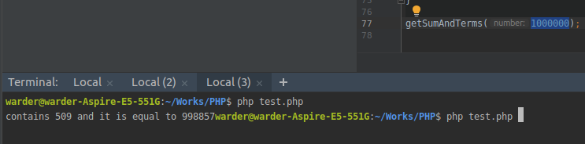
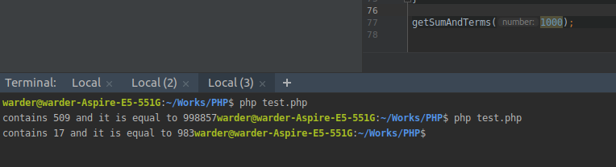
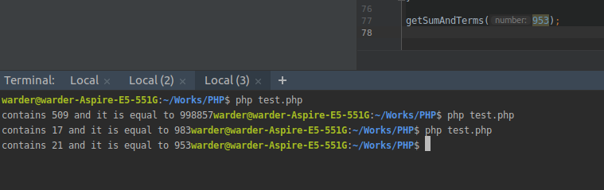
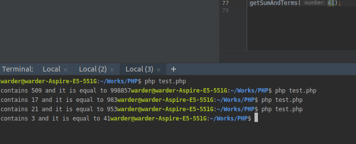

# Assignment-1
## Task
Consecutive prime sum Problem 50   
Write a simple program to implement solution to this problem using CORE PROGRAMMING LANGUAGEthat you APPLIED IN SODING

## Result 

Number = 1000000
  

Number = 1000

Number = 953

Number = 41

Question   
Which prime, below one-million, can be written as the sum of the most consecutive primes?  

Answer
prime 998857, contains 509 terms